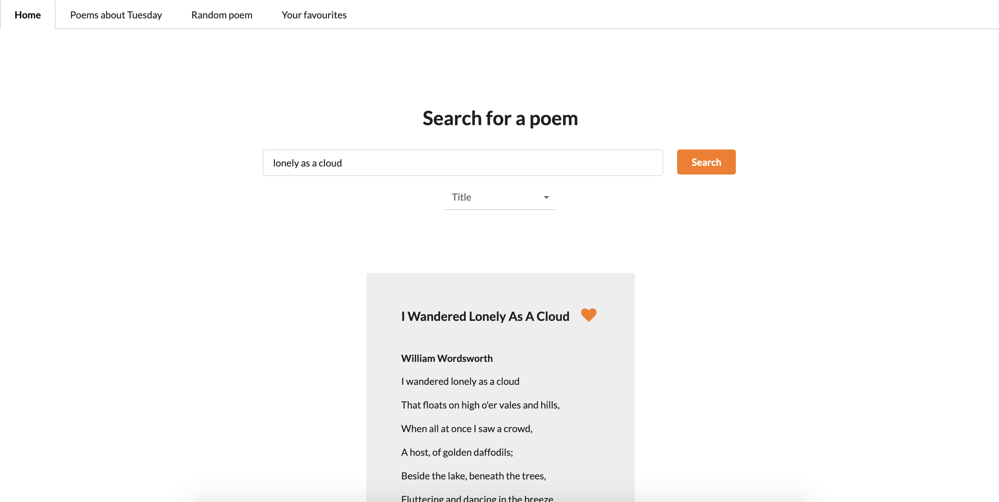

# Poems project
This is a website on which poems can be found with keywords in the title, author and lines. It also shows poems about the current day (e.g. Tuesday), a poem about a random word. Users can also store their favourite poems.

 

# Built with
* Vue
* Vuex
* Vue Router
* Semantic UI
* PoetryDB 

# Project setup
Download the repo and run `yarn install` and then `yarn serve`. The website can be found on localhost:8080.

# Wins and challenges
* It was great to work with Vue for the first time. I like how every component is structured with the template, script and style tags. It was tricky to work with Vuex in the beginning, but because I have some experience with Redux it was easier to learn and eventually I liked using the actions, mutations and getters.
* One of the things I struggled with was showing the poems in an easy to read way. Especially the really long poems were hard to style. After some Googling, I found the solution. I included a ternary statement for the styling of the poem. The amount of columns now depends on the length of the poem:

```javascript
 :style="poem.linecount > 50 ? {columnCount: 3} : {columnCount: 1}"
```

# Future improvements
* Because the API PoetryDB stores a lot of poems, it was a challenge to find poems in a relatively short time. I implemented a loader to improve the experience for the user, but I want to make this smoother and make sure that it doesn't take too long in the future.
* Semantic UI made it really easy to style for example buttons, but using their menu turn out to be more difficult than I thought. Because the different tabs need to be active, I had to create a function to do this. However, when the page is reloaded the Home tab becomes active by default. I either want to fix this bug or make my own menu so this doesn't happen anymore.