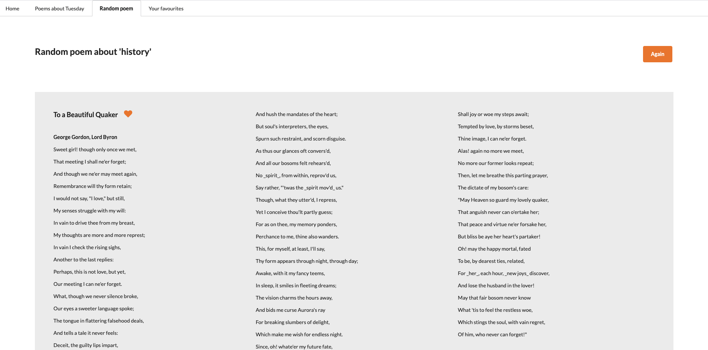

# Poems Finder
This is a website on which poems can be found by title, author and lines. It also shows poems about the current day (e.g. Tuesday) and a poem about a random word. It's also possible to store your favourite poems by clicking on the heart icon.

 

# Built with
* Vue.js
* Vuex
* Vue Router
* Node.js
* Express
* Semantic UI
* PoetryDB 

# Deployment
The Poems Finder is deployed on Heroku and can be found [here](http://poemsfinder.herokuapp.com/).

# Getting started
Download the repo and run `yarn install`. After that, run `yarn start` and go to localhost:5000.

# Website architecture
## Search on homepage
Users can search for poems on the homepage. They can choose what to search for: the title, author or lines. If they click on the search button, the following action handler is called with the relevant search term and filter option:

```javascript
const actions = {
  ...
  loadPoems: ({ commit }, payload) => {
    PoemService.getPoems({search: payload.search, filter: payload.filter })
    .then(response => {
      commit('setPoems', response)
      commit('setLoading')
    })
  }
```

## Poems based on the day
Every day, poems about that particular day are shown. I use the same action filter as on the homepage, but search on the current day. To get the current day, I use the following mutation:

```javascript
const mutations = {
  ...
  setDay: () =>  {
    const todayNumber = new Date().getDay()
    const daysOfWeek = ['Sunday', 'Monday', 'Tuesday', 'Wednesday', 'Thursday', 'Friday', 'Saturday']
    state.currentDay = daysOfWeek[todayNumber]
  },
```

The getDay function returns a number, for example 0 for 'Sunday'. With the use of the daysOfWeek array I get what day it is and then perform a search for every poem mentioning that day. 

 

## Random poem
This page shows a random poem each time. I used the Random Word package to get a random word, and then search for poems matching this word. After getting the response from the API, I then pick a random poem from that array:

```javascript
const poem = response[Math.floor(Math.random() * response.length)]
```

That way, both the word and the poem itself is random each time a user visits the page. Users can also click on the Again button to see a different random poem based on a different random word.

 

## Favourite poems
Users can save their favourite poems by clicking on the heart icon next to each poem. When they do this, I save that particular poem to their local storage. Each time they visit this page, I check for saved poems in their local storage and show this on the page. To show poems, I use the same component throughout the app, which made styling the poems a lot easier. I used the Vue Toaster package to show a message when users save a poem.

  

# Wins and challenges
* It was great to work with Vue.js for the first time. I like how every component is structured with the template, script and style tags. It was tricky to work with Vuex in the beginning, but because I have some experience with Redux it was easier to learn and eventually I liked using the actions, mutations and getters.
* One of the things I struggled with was showing the poems in an easy to read way. Especially the really long poems were hard to style. After some Googling, I found the solution. I included a ternary statement for the styling of the poem. The amount of columns now depends on the length of the poem:

```javascript
 :style="poem.linecount > 50 ? {columnCount: 3} : {columnCount: 1}"
```
* Another difficult task was deploying the project to Heroku because the request to the PoetryDB API doesn't use a secure route. To solve this, I had to add a back-end server with Node and Express. Now, the front-end action handler gets the poems from the API through the back-end server.

# Future improvements
* Because the API PoetryDB stores a lot of poems, it was a challenge to find poems in a relatively short time. I implemented a loader to improve the experience for the user, but I want to make this smoother and make sure that it doesn't take too long in the future.
* Semantic UI made it really easy to style for example buttons, but using their menu turn out to be more difficult than I thought. Because the different tabs need to be active, I had to create a function to do this. However, when the page is reloaded the Home tab becomes active by default. I either want to fix this bug or make my own menu so this doesn't happen anymore.
* It's possible to save poems, but once a user has saved a poem they cannot delete it at the moment. I would like to add this functionality and also first check if the poem is already saved before adding it to the user's local storage. That way, users cannot have the same poems in their favourite multiple times.